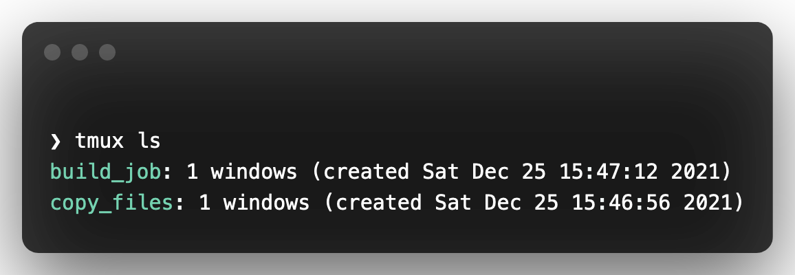

# What is tmux?

**tmux** is a command line tool to run long running tasks on a remote machine via SSH. SSH connections can break while your long running command is still being run. Tmux is the perfect solution for that. Tmux creates a kind of server on the machine you are sshing into. You can create multiple tmux sessions on the server and you can connect again even if your ssh connection drops. 

## Most Often Used Tmux Commands

- ### List available sessions:
    ``` bash
    tmux ls
    ```
    


- ### Create A New Session Named **copy-files** and connect(attach) to it:
    ``` bash
    tmux new -s copy_files
    ```

- ### Detach from an existing session: 
    <kbd>Ctrl</kbd> + <kbd>b</kbd> + <kbd>d</kbd>

- ### Attach to an existing session with name **build-job**:
    ``` bash
    tmux a -t build_job
    ```

- ### Kill an existing session:
    There are two ways for doing it
    1) Type exit while you are inside the session you want to kill.
    2) Run
        ``` bash
        tmux kill-session -t session_name        
        ```
 
 - ### Kill all sessions:
    ``` bash
    tmux kill-session -a
    ```
    
